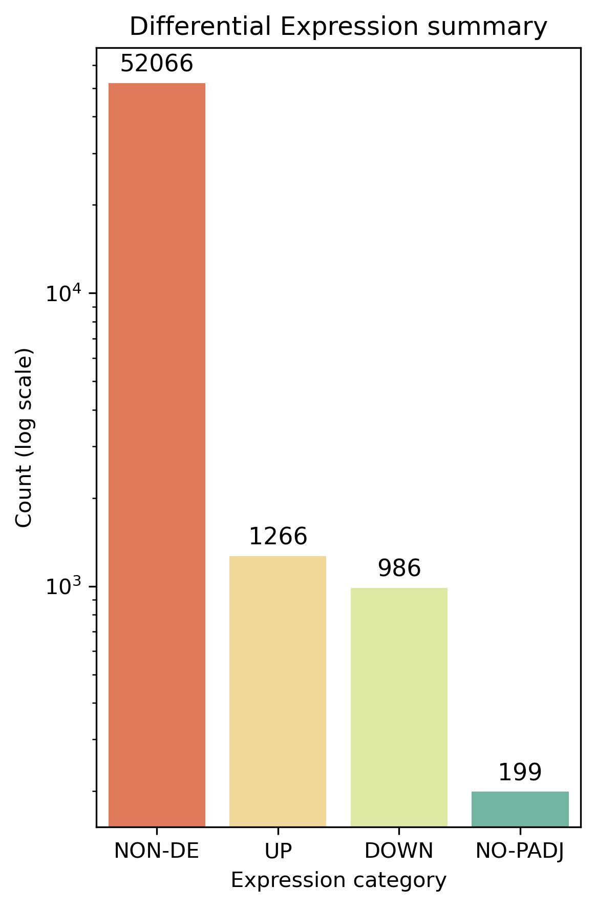
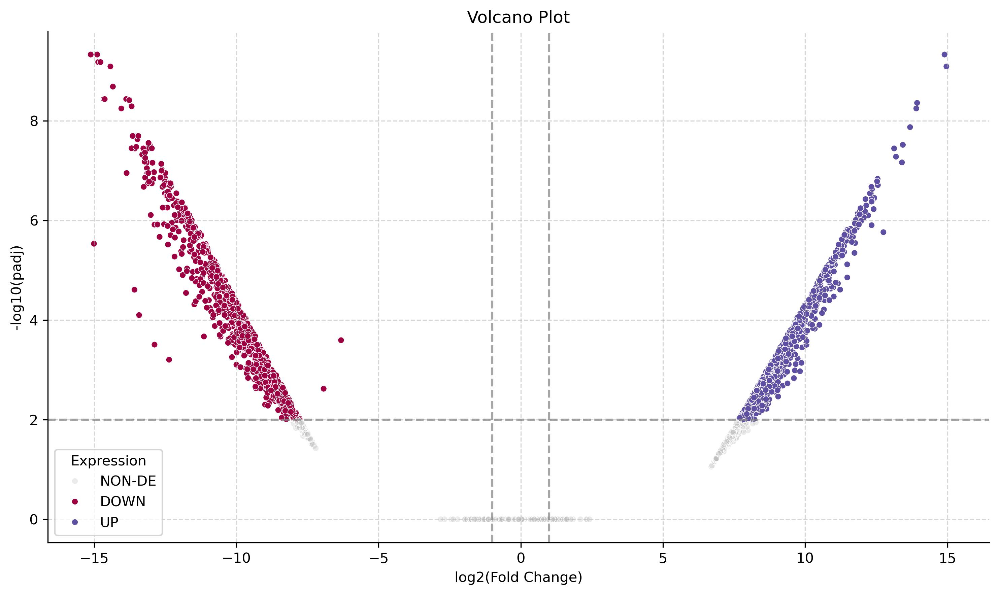

# _Haemonchus contortus_ transcriptomic analysis report

**Authors:** Ashely Yael Montiel-Vargas & Pablo Salazar-Méndez

**Date:** november 24th, 2025
## Introduction

_Haemonchus contortus_ is a hematophagous gastrointestinal nematode that infects small ruminants and represents one of the most damaging parasites in livestock production systems. Its high prevalence, pathogenicity, and capacity to rapidly develop anthelmintic resistance make it a key model organism in veterinary parasitology. In particular, resistance to ivermectin—a widely used macrocyclic lactone—has become increasingly common worldwide, posing major challenges for animal health and agricultural sustainability. Because _H. contortus_ responds quickly to selective pressures and exhibits extensive genetic and transcriptomic diversity, it serves as an ideal system for studying the molecular basis of drug resistance and adaptation [1].

In 2023, ***Reyes-Guerrero et al.*** generated a comprehensive de novo transcriptome assembly for ivermectin-susceptible (IVM-S) and **ivermectin-resistant (IVM-R) Mexican isolates of _H. contortus_**, identifying thousands of differentially expressed genes related to detoxification, efflux transport, neuromuscular signaling, and metabolic regulation. Their study provided one of the most detailed transcriptomic resources available for understanding ivermectin resistance in this species [1].

The present project aims to replicate the analytical workflow of [Reyes-Guerrero et al. (2023)](https://doi.org/10.3390/pathogens12030499) as a learning exercise, with the dual purpose of reinforcing conceptual understanding of comparative transcriptomics and developing more advanced, professional skills in Python —a programming language that has become central to modern bioinformatics—. Through the reproduction of RNA-seq processing steps, differential expression analysis, and functional annotation, this project seeks to build practical habilities in handling large-scale biological data while exploring the molecular signatures associated with ivermectin resistance in _H. contortus_. Ultimately, this replication not only strengthens computational proficiency but also deepens the biological insight into one of the most relevant parasitic nematodes in animal health.
## Methodology

### Data Acquisition

  Publicly available Illumina RNA-seq datasets from H. contortus adult males were obtained from the NCBI Sequence Read Archive (BioProject [PRJNA877658](https://www.ncbi.nlm.nih.gov/bioproject/?term=PRJNA877658)). Three biological replicates were downloaded for each condition:

  - IVM-S strain: SRR21518936, SRR21518937, SRR21518938
  - IVM-R strain: SRR21518939, SRR21518940, SRR21518941

  Raw reads (FASTQ format) were retrieved using the NCBI SRA Toolkit and stored locally for downstream processing.

### Quality Control and Preprocessing

Reads were trimmed using `cutadapt` to remove adapters, low-quality tails, and truncated sequences. Post-trimming `FastQC` was conducted to confirm improvement in read quality metrics.

  ### Transcriptome Mapping and Quantification

  Following _Reyes-Guerrero et al. (2023)_, we worked with a de novo transcriptome assembly generated in the reference study due to low alignment rates observed when Mexican isolates were mapped to existing _H. contortus genomes_ ($\lt 60$%). Reads from each sample were mapped or pseudo-aligned to this transcriptome using standard quantification tools:

- Salmon or Kallisto for lightweight pseudo-alignment
- Transcript-level quantification files (TPM and raw counts) were produced and aggregated into a respective count matrix for differential expression analysis.

### Visualization

A dedicated script was build to ease the decision process towards a more comprehensive transcriptomic analyses. This scripts offers a wide variety of functions for data visualization and files validations.
### Differential Expression Analysis

Statistical comparisons between IVM-S and IVM-R samples were performed using pyDESeq2:
1. Import count matrices
2. Correct batch effect using `inmoose.pycombat` [2,3]
3. Normalize library sizes with pyDESeq2 [4]
4. Fit negative binomial models [4]
5. Identify differentially expressed genes (DEGs) [4]

  Significance thresholds were set at:

  - $|log_2(FoldChange)| \ge 1$
  - $padj \lt 0.01$

The resulting DEG lists were separated into upregulated genes in resistant and susceptible strains.
### Functional Annotation

Differentially expressed transcripts were annotated to infer biological functions and resistance-associated pathways. Annotation steps included:

- `Trinotate` software for functional annotation (searchs in Blastx, Blastp, KEGG, GO, etc for the corresponding IDs)
	- We filtered by $\gt 55$% identity per gene and KO/GO term
- Gene Ontology (GO) functional enrichment
- KEGG pathway assignment

Special attention was given to gene families previously associated with ivermectin response, including ABC transporters, ligand-gated ion channels, cytochrome P450s, glutathione-S-transferases, and signaling components involved in neuromuscular regulation.
### Integration and Interpretation

Functional results were integrated to identify:

- Mechanistically relevant DEGs
- Molecular pathways enriched in IVM-R or IVM-S strains
- Candidate biomarkers of resistance
- Potential targets for future drug or vaccine development

This integrative step linked transcriptional signatures with known biological mechanisms of anthelmintic resistance, such as xenobiotic detoxification, efflux transport, and metabolic reprogramming.
### Reproducible Pipeline Implementation

All analyses were implemented using a modular pipeline combining Python and Bash scripts. The repository was structured to promote reproducibility, separating raw data, processed outputs, code, documentation, and temporary files. Workflow design emphasized:

- Version-controlled scripts
- Error handling during each pipeline step
- Clear documentation for future adaptation
- Automation of repetitive tasks

This approach enabled a transparent and professional implementation of transcriptomic analyses, consistent with modern bioinformatics standards.
## Results

#### Data visualization

After retrieving the _de novo_ transcriptome generated by `Trinity`, we use them for computing the count matrix using the pseudo-aligner `Salmon` from which we obtained 180400 lectures. With the count matrix, we used the visualization script to plot the distributions of the raw counts and their counts per million (CPM).

From the latter analysis we state that the sample distributions were in need of batch effect correction (see Figure 1 and the images named: `samples_pca_precombat.png` and `samples_mds_precombat.png`). First we tried to use a `u = 5`, a very high value for the threshold `CPM`, from which the distributions showed a lesser variation among samples but the groups were still visible (suceptible vs resistant). The first signed that this was a very strict threshold were the reduced number of genes, a total of 25043 from 180400 original genes.

As it is possible to see in the Figure 2, the samples distributions were more comparable with the parameter `u = 1`, and the retrieved genes were 54517 from 180400. All of this was supported by the `CPM` distribution, PCA, MDS and Kernel Density available at the directory `results/Images/` from the [GitHub repository](https://github.com/pablomics-004/H_contortus_Transcriptomics) of this study.

#### Differential Expression Analysis

The `pyDESeq2` algorithm was applied to the corrected reads described above with the following parameters:

- $|LFC| \ge 1$
- $padj \lt 10^{-2}$

Obtaining the next number of genes for each classification (see Figure 3): 
- `NON-DE` - 52066, 
- `UP` - 1266, 
- `DOWN` - 986, 
- `NON-PADJ` - 199.

_Note:_ Genes classified as `NON-PADJ` correspond to those for which no raw _p_-value was obtained from the Wald test, and therefore an adjusted _p_-value could not be computed.

Using the same criteria, a total of 2,252 genes were identified as differentially expressed (DE). The volcano plot revealed no substantial differences when applying thresholds of $∣LFC∣≥1$ versus $|LFC| \geq 2$, as all significant DE genes exhibited log2_22​ fold changes greater than approximately $∣LFC∣>7.5$ (see Figure 4). Furthermore, Figure 4 shows that the majority of genes classified as `NON-DE` fall within the non-significant region, supporting the reliability of the significance thresholds applied.

Later, we plot a heatmap using only the DE genes, that is, the 1266 overexpressed and 986 subexpressed ones. By relating the IDs to those that were annotated in a further analysis, four genes were identified to be upregulated and downregulated within the resistant and susceptible strains, respectively (see Figure 5). Those genes accomplish the following functions:

- **NFE2L2 – nuclear factor erythroid 2–related factor 2**
    - Master regulator of cellular defenses against oxidative and toxic stress.
- **ALDOA – fructose bisphosphate aldolase class I**
    - Key enzyme in glycolysis and gluconeogenesis.
- **ACP2 – lysosomal acid phosphatase**
    - Transmembrane protein that hydrolyzes phosphate esters and cycles between lysosomes, endosomes, and the plasma membrane.
- **PRPF19 – pre-mRNA processing factor 19**
    - Core spliceosome component involved in ubiquitination, DNA damage response, and repair.

Taken together, these genes suggest that ivermectin resistance in _H. contortus_ may involve enhanced cellular stress responses (NFE2L2), metabolic reprogramming (ALDOA), lysosomal processing and membrane trafficking (ACP2), and increased RNA maturation and genome maintenance (PRPF19). Such functional shifts align with known resistance mechanisms in which parasites bolster detoxification capacity, modulate energy pathways, and maintain cellular integrity under drug pressure.

Ivermectin is a macrocyclic lactone compound composed of multiple ester linkages and a large lactone ring characteristic of the avermectin family of antiparasitic agents [1,5].

#### Gene Ontology (GO) Enrichment
##### Downregulated genes:

GO enrichment analysis revealed that downregulated genes were predominantly associated with immune and defense-related biological processes. Notably, terms such as innate immune response (GO:0045087), immune response (GO:0006955), and defense response to other organism (GO:0098542) were enriched, although the number of associated genes was relatively low (2–5 genes per term). In terms of molecular function, downregulated genes were enriched for catalytic and enzymatic activities, including hydrolase activity (GO:0016787), peptidase activity (GO:0008233), and serine-type peptidase activity (GO:0008236), indicating potential suppression of protein processing and enzymatic functions. Cellular component enrichment was largely limited to membrane (GO:0016020), suggesting a minor impact on structural components.

##### Upregulated genes:

Conversely, upregulated genes exhibited strong enrichment in similar immune-related processes but with substantially higher gene counts per term (26–32 genes), indicating a more robust activation of these pathways. Molecular function enrichment highlighted extensive enzymatic and catalytic activities, including catalytic activity (GO:0003824), hydrolase activity (GO:0016787), and peptidase activity (GO:0008233), with gene counts ranging from 40 up to 272, suggesting widespread upregulation of enzymatic functions. Cellular component analysis indicated enrichment in membrane (GO:0016020) and ion/small molecule binding, reflecting potential activation of membrane-associated processes and metabolic interactions.
#### KEGG Pathway Enrichment
##### Downregulated genes:

KEGG pathway analysis of downregulated genes indicated modest enrichment in ribosome-related processes, including Ribosome (map03010) and Ribosome biogenesis in eukaryotes (map03008), as well as DNA repair pathways such as Nucleotide excision repair (map03420) and Fanconi anemia pathway (map03460). Although some pathways exhibited high odds ratios (>6), the absolute number of genes per pathway was small, and FDR values were generally above 0.05, suggesting moderate significance. Additional downregulated pathways included select metabolic processes, e.g., Nitrogen metabolism and Amino sugar and nucleotide sugar metabolism.

##### Upregulated genes:

Upregulated genes displayed pronounced enrichment in core metabolic and energy-related pathways, including the Citrate cycle (TCA cycle) (map00020), Glycolysis / Gluconeogenesis (map00010), and Oxidative phosphorylation (map00190), indicating enhanced central metabolism. Proteostasis-related pathways such as Ubiquitin mediated proteolysis (map04120), Proteasome (map03050), and Autophagy (map04140) were also significantly enriched, reflecting increased protein turnover and quality control. Additionally, RNA processing and vesicular transport pathways, including Spliceosome (map03040) and SNARE interactions in vesicular transport (map04130), were highlighted, indicating upregulation of post-transcriptional and trafficking mechanisms.

#### Summary

Overall, the enrichment analyses reveal a clear dichotomy between upregulated and downregulated genes. Downregulated genes primarily involve suppression of immune defense, ribosome function, and limited metabolic processes, whereas upregulated genes are associated with robust activation of enzymatic functions, energy metabolism, proteostasis, and RNA/protein processing pathways. These patterns suggest a coordinated cellular response, with enhanced metabolism and protein handling alongside selective downregulation of defense-related functions.

## Discussion

Transcriptomic analysis has become a central tool for understanding how organisms adjust their molecular programs in response to environmental pressures, including drug exposure. In the context of _Haemonchus contortus_, a parasite with high genetic plasticity and rapidly evolving anthelmintic resistance, studying transcriptional regulation provides a window into the biological strategies that underpin ivermectin tolerance. By replicating and extending the workflow described by Reyes-Guerrero _et al._ (2023), this project demonstrated how a systematic computational pipeline—ranging from raw data processing and normalization to differential expression and functional enrichment—enables the exploration of complex resistance phenotypes.

Through the reproducible pipeline implemented in Python and Bash, a total of **2,252 differentially expressed genes** were identified between resistant and susceptible strains. Functional enrichment analysis revealed that these genes are primarily involved in pathways related to immune responses, catalytic activity, proteolysis, central metabolism, translational regulation, and DNA repair. Such processes are consistent with known resistance mechanisms, in which parasites enhance detoxification capacity, increase protein and RNA quality control, and reprogram energy production to withstand drug-induced stress.

While canonical ivermectin-associated gene families—such as ABC transporters, ligand-gated ion channels, or calcium channels—did not emerge as significantly enriched in this dataset, our annotation relied on **Trinotate**, which aggregates information from broad multi-organism databases. This limitation may have resulted in partial or missing annotations for _H. contortus_–specific isoforms, potentially masking known resistance-related genes. Future analyses incorporating nematode-specific databases or long-read transcriptome assemblies could help resolve these gaps.

Additionally, the use of a Trinity-based assembly introduces challenges related to isoform redundancy, a known characteristic of de novo assemblers that can inflate transcript counts and influence differential expression estimates. Batch-effect correction using **pyComBat** was therefore essential in improving overall sample comparability and enhancing downstream biological interpretation.

Taken together, the results highlight the value of integrating robust bioinformatic workflows with functional analysis to investigate drug resistance in parasitic nematodes. Beyond reinforcing technical proficiency in Python-based transcriptomics, this study contributes to a better understanding of the molecular adaptations underlying ivermectin resistance in _H. contortus_, underscoring the importance of combining computational rigor with biological context in parasitology research.

## Conclusion

Overall, our findings support the view that ivermectin resistance in _Haemonchus contortus_ is not driven by a single pathway, but instead emerges from a coordinated combination of gene expression reprogramming, metabolic adjustment, and enhanced protein quality control. The enrichment of genes involved in central metabolism, proteostasis, RNA processing, and stress responses suggests that resistant parasites actively remodel their cellular machinery to withstand drug pressure. These transcriptomic signatures underscore the need for complementary functional studies—such as targeted knockdowns, protein activity assays, and in vivo validation—to clarify causal mechanisms and to translate candidate genes into actionable markers or therapeutic targets.

## Limitations

It is important to note that the resolution of our analyses was constrained by the absence of a high-quality reference genome and corresponding GFF annotation for the Mexican isolates of _H. contortus_. As a consequence, our workflow relied on a de novo transcriptome assembly, which inherently introduces challenges such as isoform redundancy, incomplete structural annotation, and limited gene-to-feature mapping accuracy. These factors reduced the level of genomic resolution attainable in this study and may have prevented the identification or correct annotation of key genes and isoforms associated with ivermectin resistance. Future work incorporating a curated reference genome and well-supported gene models would allow for more precise transcript quantification, improved annotation, and deeper biological interpretation.
## Acknowledgments

We sincerely thank M.Sc. Verónica Jiménez-Jacinto, PhD Leticia Vega-Alvarado, M.Tech. Shirley Alquicira-Hernández, and undergraduate student and teaching assistant Mario A. Limón-Hernández for their guidance and support throughout the 2026-1 semester of the B.Sc. in Genomic Sciences. Their mentorship was invaluable in helping shape this project into its current form.
## References

[1] Reyes-Guerrero, D. E., Jiménez-Jacinto, V., Alonso-Morales, R. A., Alonso-Díaz, M. Á., Maza-Lopez, J., Camas-Pereyra, R., Olmedo-Juárez, A., Higuera-Piedrahita, R. I., & López-Arellano, M. E. (2023). Assembly and Analysis of Haemonchus contortus Transcriptome as a Tool for the Knowledge of Ivermectin Resistance Mechanisms. Pathogens, 12(3), 499. https://doi.org/10.3390/pathogens12030499

[2] Colange M, Appé G, Meunier L, Weill S, Johnson WE, Nordor A, Behdenna A. (2025) Bridging the gap between R and Python in bulk transcriptomic data analysis with InMoose. Nature Scientific Reports 15;18104. https://doi.org/10.1038/s41598-025-03376-y.

[3] Behdenna A, Colange M, Haziza J, Gema A, Appé G, Azencot CA and Nordor A. (2023) pyComBat, a Python tool for batch effects correction in high-throughput molecular data using empirical Bayes methods. BMC Bioinformatics 24;459. https://doi.org/10.1186/s12859-023-05578-5.

[4] Muzellec, B., Teleńczuk, M., Cabeli, V., & Andreux, M. (2023). PyDESeq2: a python package for bulk RNA-seq differential expression analysis. Bioinformatics, 39(9). https://doi.org/10.1093/bioinformatics/btad547

[5] Chen, I., & Kubo, Y. (2017). Ivermectin and its target molecules: shared and unique modulation mechanisms of ion channels and receptors by ivermectin. _The Journal Of Physiology_, _596_(10), 1833-1845. https://doi.org/10.1113/jp275236